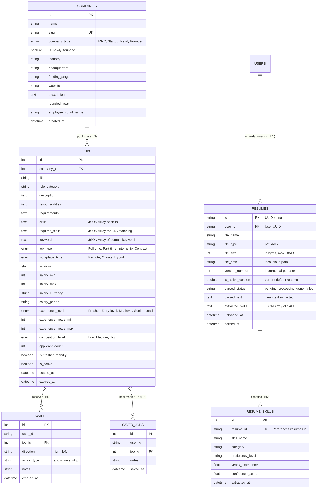

# 📖 SwipeX — Data Dictionary & Schema Documentation (Milestone 3)

> **Module:** Job & Data Intelligence Service  
> **Author:** Shubham Ugale (`Job & Data Intelligence`)  
> **Status:** Milestone 3 Production-Ready  
> **Database:** PostgreSQL / SQLite (Development) with Redis Caching Layer  

---

## 1. Database Architecture Overview

The SwipeX data layer is designed for high-throughput swipe recording, rapid faceted job discovery, multi-version resume management, and real-time ATS compatibility scoring.

---

## 2. Table Specifications

### 2.1 `resumes` Table (Milestone 3 Core)
Stores user resume uploads with complete multi-version history, status lifecycle, and parsed skill summaries.

| Column | Type | Constraints | Description |
|---|---|---|---|
| `id` | `VARCHAR(36)` | Primary Key, UUID | Unique resume identifier (e.g. `b1a2c3d4-0000-4444-8888-abcdefabcdef`) |
| `user_id` | `VARCHAR(36)` | Not Null, Indexed | Foreign key referencing authenticated Job Seeker |
| `file_name` | `VARCHAR(255)` | Not Null | Original filename (e.g. `asha_resume_v3.pdf`) |
| `file_type` | `VARCHAR(50)` | Not Null | File extension: `pdf` or `docx` |
| `file_size` | `INTEGER` | Not Null, Default 0 | File size in bytes (max 10MB enforced) |
| `file_path` | `VARCHAR(500)` | Not Null | File system location (`uploads/resumes/{user_id}/...`) |
| `version_number` | `INTEGER` | Not Null, Default 1 | Auto-incrementing version number for this user |
| `is_active_version`| `BOOLEAN` | Not Null, Indexed | `True` if this is the active default resume |
| `parsed_status` | `VARCHAR(50)` | Not Null, Indexed | Lifecycle status: `pending`, `processing`, `done`, `failed` |
| `parsed_text` | `TEXT` | Nullable | Full extracted plain text of the resume |
| `extracted_skills`| `TEXT` | Nullable, JSON String | Array of skills (e.g. `["Python", "FastAPI", "SQL"]`) |
| `uploaded_at` | `DATETIME` | Not Null, Indexed | UTC upload timestamp |
| `parsed_at` | `DATETIME` | Nullable | UTC timestamp when NLP parsing completed |

**Indexes & Performance:**
- `ix_resumes_user_version`: Composite index on `(user_id, version_number)` for fast version timeline lookups.
- `ix_resumes_user_active`: Composite index on `(user_id, is_active_version)` for instant default resume resolution.

---

### 2.2 `resume_skills` Table (Milestone 3 Normalized Entity)
Stores normalized extracted skills per resume version for relational queries, skill aggregation, and inverted index lookups.

| Column | Type | Constraints | Description |
|---|---|---|---|
| `id` | `INTEGER` | Primary Key, Auto-increment | Unique skill entry ID |
| `resume_id` | `VARCHAR(36)` | Foreign Key (`resumes.id`), Cascade Delete | Target resume |
| `skill_name` | `VARCHAR(100)` | Not Null, Indexed | Name of recognized skill (e.g. `Docker`, `Python`) |
| `category` | `VARCHAR(100)` | Nullable, Indexed | Category: Programming, Cloud, Frameworks, etc. |
| `proficiency_level`| `VARCHAR(50)` | Nullable | `Beginner`, `Intermediate`, `Expert` |
| `years_experience` | `FLOAT` | Nullable | Estimated years of experience |
| `confidence_score` | `FLOAT` | Not Null, Default 1.0 | NER / model confidence score (0.0 to 1.0) |
| `extracted_at` | `DATETIME` | Not Null | Extraction timestamp |

**Indexes & Performance:**
- `ix_resume_skills_name`: Index on `skill_name` for aggregate skill queries and market demand analytics.
- `ix_resume_skills_resume_skill`: Composite index on `(resume_id, skill_name)` for fast deduplication.

---

### 2.3 `jobs` Table (Extended for Milestone 3)
Stores rich job postings with structured required skills and domain keywords for ATS scoring.

| Column | Type | Constraints | Description |
|---|---|---|---|
| `id` | `INTEGER` | Primary Key, Auto-increment | Unique job ID |
| `company_id` | `INTEGER` | Foreign Key (`companies.id`), Indexed | Employer reference |
| `title` | `VARCHAR(255)` | Not Null, Indexed | Job title |
| `role_category` | `VARCHAR(100)` | Nullable, Indexed | Category: Backend, Frontend, AI/ML, Design, etc. |
| `description` | `TEXT` | Not Null | Full job overview |
| `skills` | `TEXT` | Not Null, JSON Array | All associated skills |
| `required_skills` | `TEXT` | Nullable, JSON Array | **[M3]** Core mandatory skills for ATS scoring |
| `keywords` | `TEXT` | Nullable, JSON Array | **[M3]** Domain keywords (e.g. `Microservices`, `CI/CD`) |
| `job_type` | `VARCHAR(50)` | Not Null, Indexed | `Full-time`, `Part-time`, `Internship`, `Contract` |
| `workplace_type` | `VARCHAR(50)` | Not Null, Indexed | `Remote`, `On-site`, `Hybrid` |
| `location` | `VARCHAR(255)` | Not Null, Indexed | Job location |
| `salary_min` | `INTEGER` | Nullable, Indexed | Minimum salary |
| `salary_max` | `INTEGER` | Nullable, Indexed | Maximum salary |
| `experience_level`| `VARCHAR(50)` | Not Null, Indexed | `Fresher`, `Entry-level`, `Mid-level`, `Senior`, `Lead` |
| `competition_level`| `VARCHAR(50)`| Not Null, Indexed | `Low`, `Medium`, `High` |
| `applicant_count` | `INTEGER` | Not Null, Default 0 | Total applicants count |
| `is_fresher_friendly`| `BOOLEAN` | Not Null, Indexed | Fresher suitable |
| `is_active` | `BOOLEAN` | Not Null, Indexed | Active job listing status |
| `posted_at` | `DATETIME` | Not Null, Indexed | Timestamp of job posting |

---

### 2.4 `companies` Table
Stores enterprise employer and startup profiles.

| Column | Type | Constraints | Description |
|---|---|---|---|
| `id` | `INTEGER` | Primary Key, Auto-increment | Unique company ID |
| `name` | `VARCHAR(255)` | Not Null, Indexed | Organization name |
| `slug` | `VARCHAR(255)` | Unique, Not Null | URL slug (e.g. `google`, `novaai-labs`) |
| `company_type` | `VARCHAR(50)` | Not Null, Indexed | `MNC`, `Startup`, `Newly Founded` |
| `is_newly_founded` | `BOOLEAN` | Not Null, Indexed | Startup flag for new ventures |
| `industry` | `VARCHAR(255)` | Not Null, Indexed | Industry classification |
| `funding_stage` | `VARCHAR(100)` | Nullable | Funding round |
| `headquarters` | `VARCHAR(255)` | Nullable | Primary office location |

---

### 2.5 `swipes` and `saved_jobs` Tables
Stores candidate interactions and bookmarked roles with unique candidate-job constraints.

---

## 3. ATS Scoring & FR-04 Compatibility Logic

Implemented in `app/core/resume_service.py` (`ResumeService.compute_ats_score`):

1. **Required Skill Overlap (70% weight):**
   $$\text{skill\_ratio} = \frac{|\text{resume\_skills} \cap \text{job\_required\_skills}|}{|\text{job\_required\_skills}|}$$

2. **Domain Keyword Relevance (30% weight):**
   $$\text{keyword\_ratio} = \frac{|\text{resume\_keywords} \cap \text{job\_keywords}|}{|\text{job\_keywords}|}$$

3. **Blended ATS Score (0 - 100):**
   $$\text{match\_score} = \text{round}((\text{skill\_ratio} \times 70.0) + (\text{keyword\_ratio} \times 30.0), 1)$$

4. **FR-04 Threshold Rule:**
   - If $\text{match\_score} < 80.0\%$: Identifies and populates `missing_skills` and `missing_keywords`.
   - If $\text{match\_score} \ge 80.0\%$: Both `missing_skills` and `missing_keywords` return as empty arrays `[]` (never omitted or null).

---

## 4. Milestone 4 Handoff Notes (Analytics, Notifications & Dashboards)

As defined in SRS Section 9.3 (Day 7 Handoff), Milestone 4 modules (Modules 8–10: Notification Service, Candidate Application Tracking, Recruiter Analytics) will consume the following data assets:

1. **Candidate Application Pipeline (Module 8):**
   - When a candidate swipes right (`SwipeActionType.APPLY`), the application record can link directly to the candidate's active `Resume.id` (`is_active_version = True`) and store the snapshot `match_score` from `POST /api/v1/ats/score`.
   - Recruiters can view applicant rankings sorted by `match_score` descending.

2. **Skill Gap Notifications (Module 9):**
   - The Notification Service can query resumes with `match_score < 80%` on saved jobs (`saved_jobs`) and send actionable alerts: *"Add Docker or AWS to your resume to increase your ATS score for Role X from 74% to 88%"*.

3. **Recruiter Talent Analytics (Module 10):**
   - Aggregate `resume_skills` across applicants to produce hiring velocity and skill availability curves.
   - Correlate `Job.applicant_count` against `Job.competition_level` to recommend salary adjustments.
